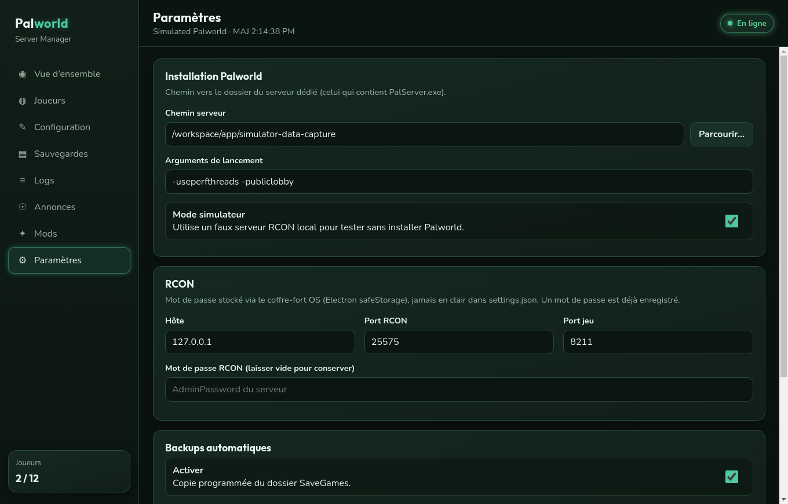

# Palworld Server Manager

Dashboard desktop **Electron + React + TypeScript** pour administrer un serveur dédié Palworld  
(start/stop, joueurs RCON, éditeur de config, sauvegardes, logs live, mods, annonces).

> Ce dossier `app/` contient l’application GUI.  
> Les scripts PowerShell / templates SteamCMD du dépôt parent restent disponibles pour installer le serveur.

## Aperçu de l’interface



[Vidéo démo (MP4)](../docs/screenshots/demo-ui.mp4) · [Galerie complète](../docs/screenshots/README.md)

<p align="center">
  
  
</p>
<p align="center">
  
  
</p>

## Prérequis (développement)

- Node.js 20+
- npm 10+
- (Build Windows depuis Linux) Wine 64 bits

## Installation

```bash
cd app
npm install
```

## Lancer en développement

```bash
npm run dev
```

### Mode simulateur (sans Palworld installé)

1. Ouvrir **Paramètres**
2. Activer **Mode simulateur**
3. Définir un chemin de données (ex. `./simulator-data`)
4. Mot de passe RCON : `admin` (ou celui que vous enregistrez)
5. Port RCON : `25575`
6. Enregistrer → **Vue d’ensemble** → **Start**

Le simulateur crée automatiquement `PalWorldSettings.ini`, SaveGames, logs et mods fictifs.

## Configuration (serveur réel)

1. Installer le dedicated server (voir README racine / scripts PowerShell)
2. Dans `PalWorldSettings.ini` activer :
   - `RCONEnabled=True`
   - `RCONPort=25575` (ou autre)
   - `AdminPassword=...` (ce mot de passe = mot de passe RCON)
3. Dans l’app **Paramètres** :
   - **Chemin serveur** = dossier contenant `PalServer.exe`
   - **Hôte / port RCON**
   - **Mot de passe RCON** (stocké via le coffre-fort OS `safeStorage`, pas en clair dans `settings.json`)
4. Démarrer le serveur (bouton Start ou vos scripts), puis utiliser le dashboard

## Fonctionnalités

| Panneau | Contenu |
|---------|---------|
| Vue d’ensemble | Statut, joueurs, uptime, CPU/RAM, Start/Stop/Restart/Save |
| Joueurs | Liste RCON, kick, ban, whitelist, banlist locale |
| Configuration | Éditeur graphique de `PalWorldSettings.ini` |
| Sauvegardes | Backup / restore SaveGames + planification auto |
| Logs | Flux live + filtre |
| Annonces | Broadcast RCON |
| Mods | Activer / désactiver `.pak` |
| Paramètres | Chemins, RCON, backups auto, simulateur |

## Tests

```bash
npm test           # unitaires (parse INI / joueurs)
npm run test:smoke # intégration mock RCON + fichiers
npm run test:e2e   # scénario bout-en-bout mock
npm run typecheck
```

Journal détaillé : [`../JOURNAL.md`](../JOURNAL.md)

## Build de l’exécutable Windows

```bash
cd app
npm run dist
```

Artefacts :

- **`release/PalworldServerManager.exe`** — portable unique (double-clic)
- `release/win-unpacked/` — version décompressée (debug)

Sous Linux, Wine est nécessaire pour le target portable electron-builder.

Sous Windows natif :

```powershell
cd app
npm install
npm run dist
```

## Logs de diagnostic

L’application écrit `app.log` dans le dossier userData Electron  
(ex. `%APPDATA%\palworld-server-manager\logs\app.log` sur Windows).  
Ouvrable depuis **Paramètres → Ouvrir app.log**.

## Licence

MIT — voir le fichier LICENSE à la racine du dépôt.
