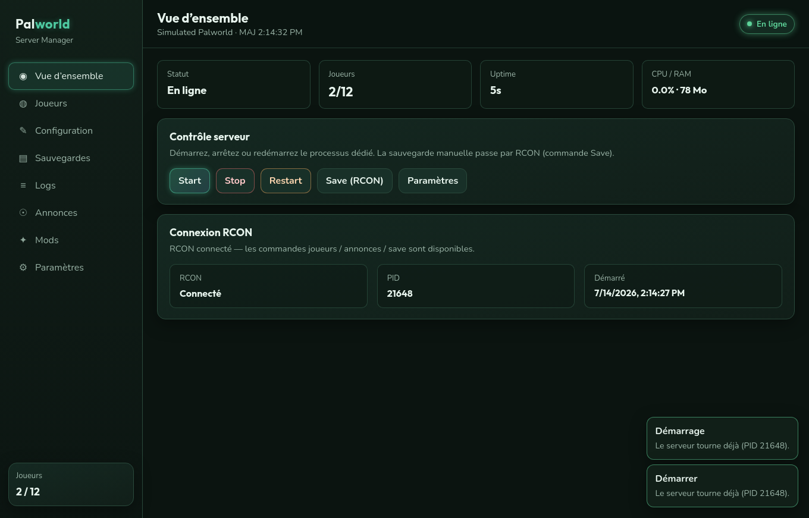
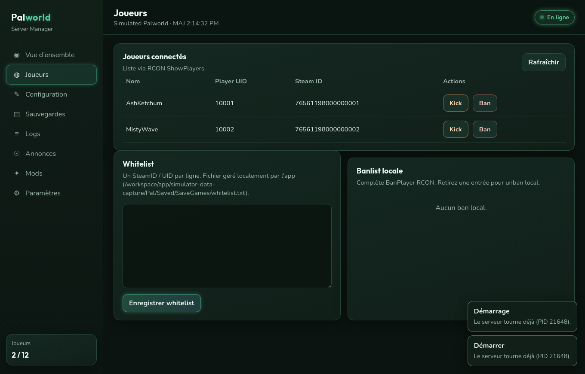
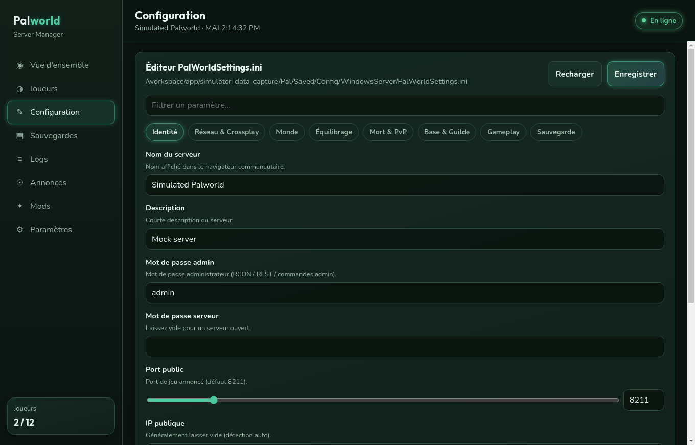
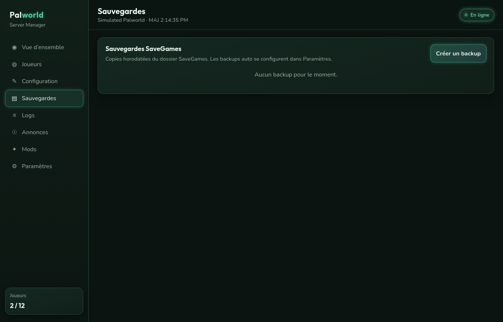
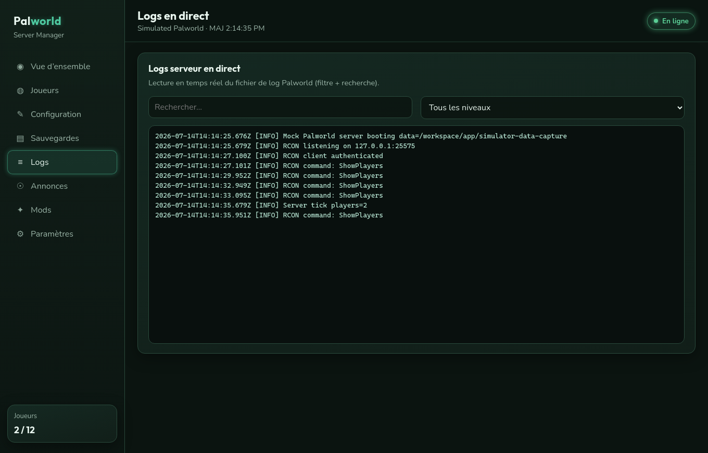
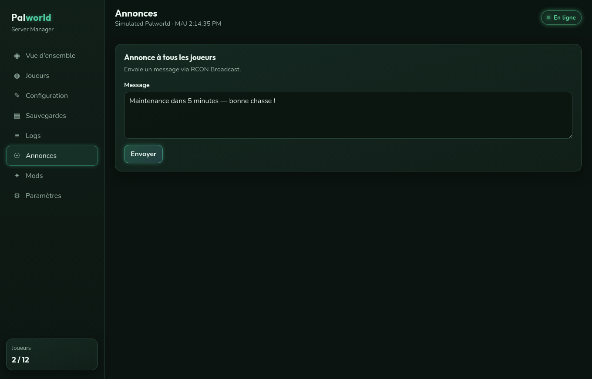
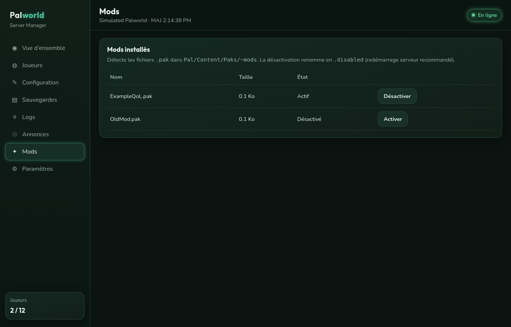
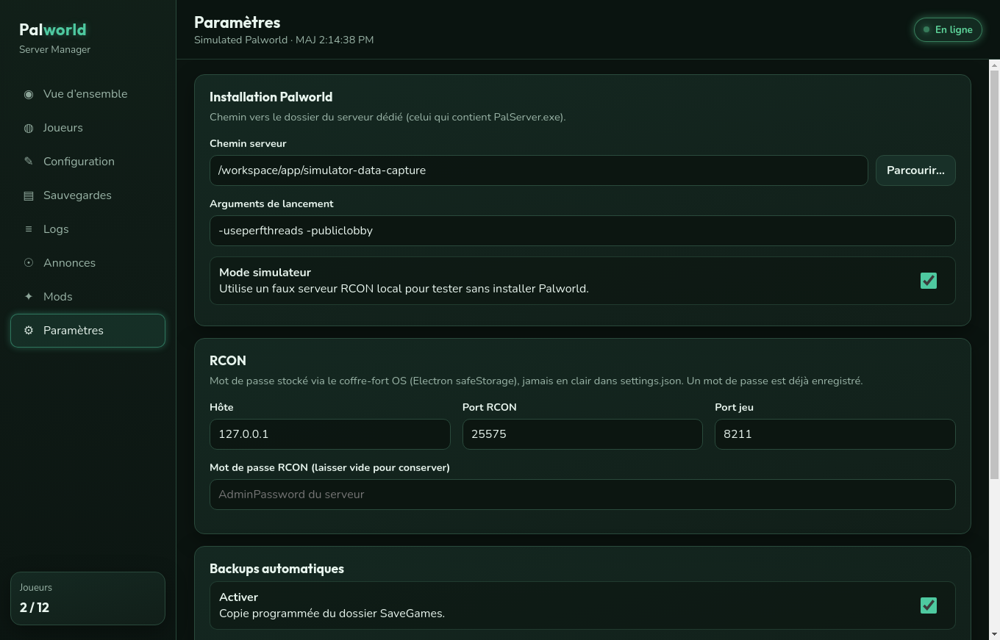

# Captures d’interface — Palworld Server Manager

Captures générées automatiquement via Electron `capturePage` + enregistrement X11 (`scripts/capture-ui.sh`).

## Vidéo démo

[Demo UI (MP4)](./demo-ui.mp4)

## Galerie

| Écran | Aperçu |
|-------|--------|
| Vue d’ensemble |  |
| Joueurs |  |
| Configuration |  |
| Sauvegardes |  |
| Logs |  |
| Annonces |  |
| Mods |  |
| Paramètres |  |

### Régénérer

```bash
cd app
bash scripts/capture-ui.sh
```
